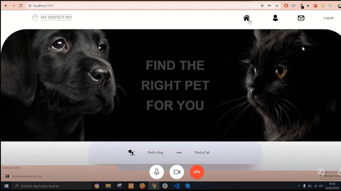
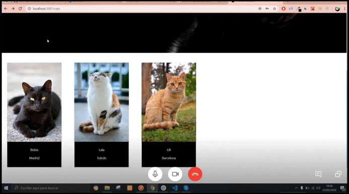
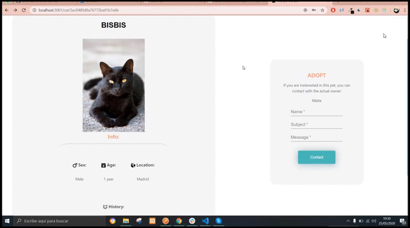

# Pets adoption.

Este proyecto es una pagina web en la cual puedes buscar perros y gatos para adoptarlos,
dar en adopción tu propia mascota, editar u borrar tus publicaciones (si eres administrador puedes hacerlo con todas), 
indicar cuándo una de tus animales en adopción ha sido finalmente adoptado,
contactar y valorar a los usuarios.

## Tecnologías que he utilizado 🛠️
> HTML5 , CSS3,Layout( Flex ), Responsive Design,
JavaScript, React-Redux, Axios,Node, Express, MongoDB.
 ---

Puedes ver las publicaciones y buscar por localización.

 

Una vez en la publicación, puedes contactar con quien la ha publicado.

 

También puedes ver el perfil de las personas que publican y evaluarles.

